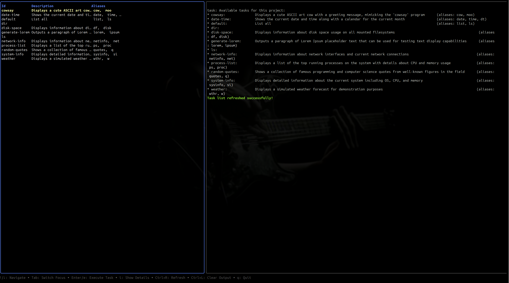

# Tash

Tash is a TUI (Text User Interface) application for viewing and executing tasks from Taskfiles. It provides an interactive terminal interface to work with tasks defined in [Taskfile.dev](https://taskfile.dev) format.



## Features

- Browse and view task information from Taskfiles
- Execute tasks with real-time output display
- Interactive split-screen interface with task list and output panels
- Task information display including ID, description, and aliases
- Visual feedback for task execution status
- Keyboard-driven navigation and control

## Installation

### Prerequisites

- Go 1.19 or later
- A working installation of [Task](https://taskfile.dev)

### From Source

Clone the repository and build:

```bash
git clone https://github.com/Aj4x/tash
cd tash
go build
```

### Using Go Install

```bash
go install github.com/Aj4x/tash@latest
```

## Usage

Run `tash` in a directory that contains a Taskfile.yml:

```bash
tash
```

### Key Controls

- **Navigation:**
    - `Tab` - Switch focus between task list and output viewport
    - `↑`/`↓` or `j`/`k` - Navigate up and down in focused panel
    - `PgUp`/`PgDn` - Scroll output viewport by pages

- **Actions:**
    - `Enter` or `e` - Execute selected task
    - `i` - Show detailed information about selected task
    - `Ctrl+l` - Clear the output viewport
    - `Ctrl+r` - Refresh task list from Taskfile

- **Application:**
    - `q`, `Esc`, or `Ctrl+c` - Quit application

## Interface

Tash features a split-screen interface:

1. **Left Panel** - Task Table:
    - Lists all available tasks with their ID, description, and aliases
    - Highlights currently selected task
    - Shows focused state with colored border

2. **Right Panel** - Output Viewport:
    - Displays command output in real-time
    - Supports scrolling for long outputs
    - Different colors for application messages, command output, and errors

3. **Help Bar** - Bottom of screen:
    - Shows available keyboard shortcuts

## How It Works

Tash runs the `task --list-all` command to gather information about available tasks in the current directory. It parses this output to create an interactive task list.

When you execute a task, Tash runs the corresponding `task <taskname>` command and displays the output in real-time in the right panel.

## Development

### Dependencies

Tash is built with these primary libraries:
- [BubbleTea](https://github.com/charmbracelet/bubbletea) - Terminal UI framework
- [Bubbles](https://github.com/charmbracelet/bubbles) - UI components (table, viewport)
- [Lipgloss](https://github.com/charmbracelet/lipgloss) - Styling primitives

### Building from Source

1. Clone the repository
2. Install dependencies:
   ```bash
   go mod tidy
   ```
3. Build the application:
   ```bash
   go build
   ```

### Project Structure

- `main.go` - Main application code
- `README.md` - Documentation
- `go.mod`, `go.sum` - Go module files

## Contributing

Contributions are welcome! Please feel free to submit a Pull Request.

1. Fork the repository
2. Create your feature branch (`git checkout -b feature/amazing-feature`)
3. Commit your changes (`git commit -m 'Add some amazing feature'`)
4. Push to the branch (`git push origin feature/amazing-feature`)
5. Open a Pull Request

## License

Distributed under the MIT License. See `LICENSE` for more information.

## Acknowledgements

- [Taskfile](https://taskfile.dev) for the amazing task runner
- [Charm](https://charm.sh) for the excellent terminal UI libraries